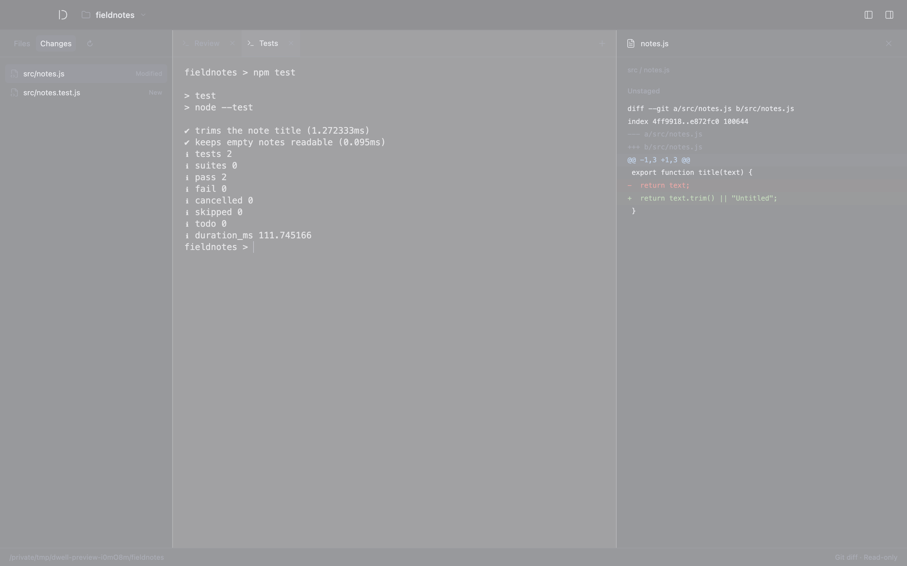

<p align="center"></p>
<h1 align="center">Dwell</h1>
<p align="center">A little room to focus.</p>

<p align="center">
  <a href="https://github.com/mchl-schrdng/dwell-terminal/actions/workflows/ci.yml"></a>
  <a href="https://github.com/mchl-schrdng/dwell-terminal/actions/workflows/codeql.yml"></a>
  <a href="https://github.com/mchl-schrdng/dwell-terminal/releases/latest"></a>
  <a href="LICENSE"></a>
</p>

A quiet terminal for macOS. Your files on the left, independent terminal tabs in the center, and a live preview on the right.



- Run a server, execute tests and work in separate terminal tabs.
- Preview code, Markdown and images as files change on disk.
- Review Git changes and drop file paths straight into your prompt.
- Get quiet attention alerts, with an optional desktop orb.
- A single visual identity: plain, translucent graphite.

## Get Dwell

[Download for Apple Silicon](https://github.com/mchl-schrdng/dwell-terminal/releases/latest). Unzip, move **Dwell.app** to Applications, then choose **Open Folder**.

Dwell uses your existing shell and command-line tools. This release is not Apple-notarized.

| Shortcut  | Action                   |
| --------- | ------------------------ |
| ⌘T / ⌘W   | Open / close a terminal  |
| ⌘O        | Open a folder            |
| ⌘B / ⌘⇧P  | Toggle files / preview   |
| ⌘J        | Focus the terminal       |
| ⌘⇧[ / ⌘⇧] | Previous / next terminal |

Double-click a terminal tab to rename it (or press F2 while the tab is focused). Press Enter to save or Escape to cancel. Tab names and their order are restored for each project with fresh shell sessions.

Previews are read-only. Project layout is restored on relaunch; running shell sessions are not. Dwell adds no telemetry, accounts or cloud sync.

## Working with Claude Code

Choose **Changes** above the file tree to review staged and unstaged edits separately. Click a changed file to see its diff in the preview. New and deleted files are included; renames appear as a deletion and an addition. Changes refresh while the view is visible, with a refresh button for an immediate check. Dwell never stages, commits or discards changes. Submodule contents are excluded, and large previews are bounded.

Drag a file from **Files**, **Changes**, or Finder into a running terminal to insert its quoted absolute path. This works after changing directories and handles spaces and apostrophes. Dropping a file does not press Enter. Up to 32 files can be dropped from Finder at once; paths containing control characters are rejected.

When a terminal rings its bell, Dwell marks its tab if you are elsewhere. **View → Desktop Orb** enables a small cloud of dust above your desktop windows. Its particles drift slowly in silver blue at rest, turn amber and move more freely for an alert, and become copper when several terminals are waiting. Colors and movement ease back to idle as alerts are opened. Click to open the waiting terminal, drag to move, or right-click to hide. Reduced motion stops the animation while preserving the color and count; reduced transparency adds a solid backing. Its position and enabled state are saved. It is off by default. With the orb off, background alerts use silent macOS notifications, subject to your system notification settings. Repeated alerts from the same pending terminal are grouped.

The orb reacts to requests for attention, not to launching Claude or to ongoing work. Alerts appear when another terminal is selected or Dwell is in the background.

To have Claude Code send these alerts, add this setting to your existing `~/.claude/settings.json`, preserving its other settings:

```json
{
  "preferredNotifChannel": "terminal_bell"
}
```

See [Claude Code's terminal configuration](https://code.claude.com/docs/en/terminal-config#get-a-terminal-bell-or-notification) for notification timing. **Help → Claude Code Alerts…** also explains the setup. Dwell does not change your Claude settings or inspect conversation transcripts. The orb reports a request for attention, not whether a task succeeded.

## Development

Requires an Apple Silicon Mac and Node.js 24.

```sh
npm ci
npm start
```

```sh
npm run check     # Lint, formatting, unit tests and build
npm run test:app  # Real terminal and desktop integration tests
npm run package  # macOS app, ZIP and SHA-256 checksum
```

CI runs on every pull request. Version tags run the release checks. Releases are published by [mchl-schrdng](https://github.com/mchl-schrdng) after those checks pass.

[Contributing](CONTRIBUTING.md) · [Agent instructions](AGENTS.md) · [Security](SECURITY.md) · [MIT license](LICENSE)
