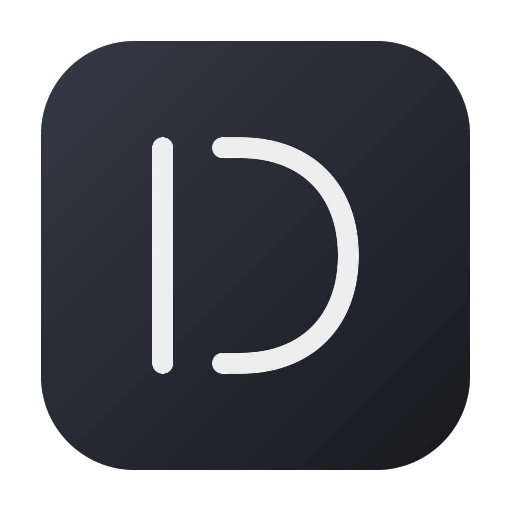
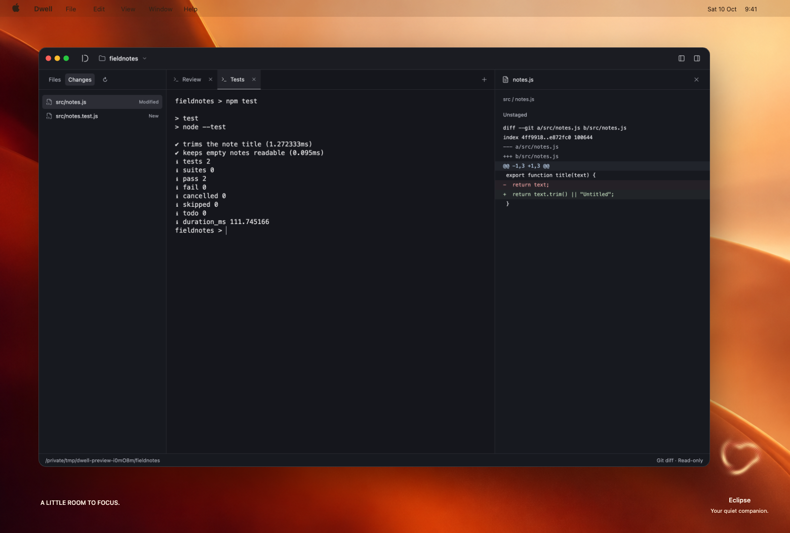
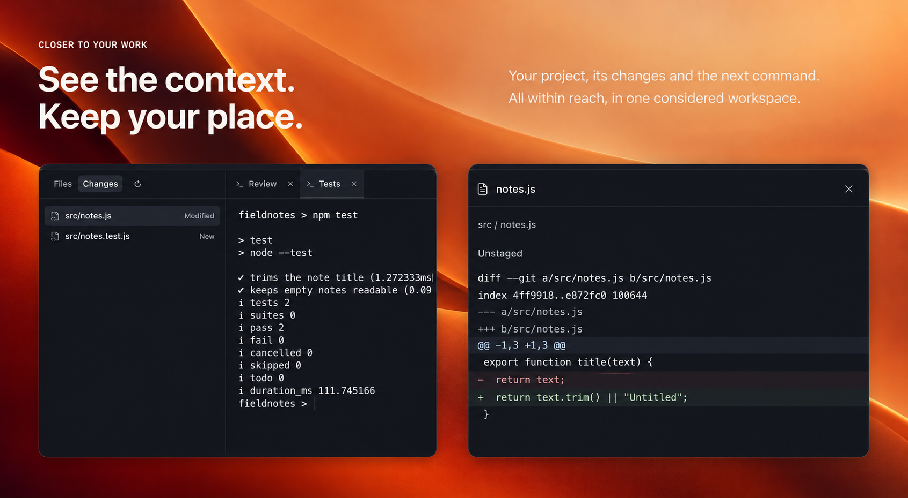
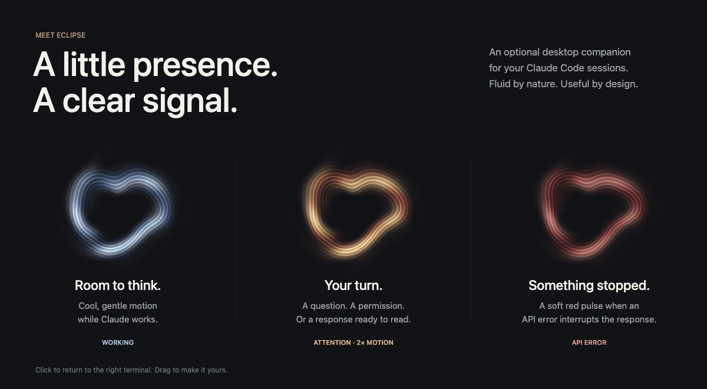

<p align="center">
  
</p>

<h1 align="center">Dwell</h1>
<p align="center"><strong>A little room to focus.</strong></p>
<p align="center">A quiet macOS terminal, made for working with Claude Code.</p>

<p align="center">
  <a href="https://github.com/mchl-schrdng/dwell-terminal/releases/latest"><strong>Download for Apple Silicon</strong></a>
  &nbsp; · &nbsp;
  <a href="docs/guide.md">Getting started</a>
  &nbsp; · &nbsp;
  <a href="https://github.com/mchl-schrdng/dwell-terminal/releases">What's new</a>
</p>

<br>



<p align="center"><sub>A real Dwell capture, composed on an original desktop backdrop.</sub></p>

<br>

## Your tools. A little more room.

Your shell, your projects, your way of working. Dwell brings the things you reach for into one quiet workspace.

- **Room for every task.** Independent terminals for Claude, your server and your tests. Name a tab and keep your place.
- **Context within reach.** Preview code, Markdown and images as they change. Drop a file into the terminal to insert its path.
- **Changes in plain sight.** Review staged and unstaged Git diffs beside the conversation that created them.

The [source preview](docs/guide.md#claude-workspaces-source-preview) adds isolated Claude worktrees, exact conversation resume, file references and a reason card for Eclipse. These additions are unreleased and require Claude Code 2.1.296+ for workspaces.



<br>

## Meet Eclipse.

A small, optional presence on your desktop. Fluid light that lets you know when Claude needs you, even while you're doing something else.

<picture>
  <source media="(prefers-reduced-motion: reduce)" srcset="docs/images/readme/eclipse-still.png">
  
</picture>

**Cool while working. Amber for your attention. Red for an API error.** Amber moves twice as fast. Click Eclipse to return to the terminal that needs you, drag it anywhere, or hide it when you want the desktop to yourself.

### A sound that gives you space.

An original, quiet spatial chime accompanies background alerts. A little nudge when you're elsewhere. Silence while you're already there.

[Listen to the chime ↗](https://github.com/mchl-schrdng/dwell-terminal/raw/refs/heads/main/src/orb-notification.wav) · Toggle it in **View → Notification Sound**.

Eclipse respects reduced motion. Its idle movement is decorative; a finished response does not guarantee that a task succeeded. [How Claude notifications work →](docs/claude-notifications.md)

<br>

## Make yourself at home.

1. **Install Dwell.** [Download the latest release](https://github.com/mchl-schrdng/dwell-terminal/releases/latest), unzip it, and move **Dwell.app** to Applications.
2. **Open a project.** Choose **Open Folder**. Your existing shell and command-line tools are ready to use.
3. **Bring Claude along.** Enable **Help → Claude Code Integration**, then start a new interactive Claude Code session. Show Eclipse with **View → Desktop Orb**.

Requires an Apple Silicon Mac. Claude integration requires Claude Code 2.1.141 or later, installed separately. The release is not Apple-notarized; see the [installation guide](docs/guide.md#install) if macOS blocks it.

Dwell adds no telemetry, accounts or cloud sync. Previews are read-only. Your layout comes back on relaunch; running shell sessions do not.

<details>
<summary><strong>A few shortcuts worth knowing</strong></summary>

| Shortcut  | Action                   |
| --------- | ------------------------ |
| ⌘T / ⌘W   | Open / close a terminal  |
| ⌘O        | Open a folder            |
| ⌘B / ⌘⇧P  | Toggle files / preview   |
| ⌘J        | Focus the terminal       |
| ⌘⇧[ / ⌘⇧] | Previous / next terminal |

Double-click a tab to rename it. More in the [guide](docs/guide.md).

</details>

<details>
<summary><strong>Build it yourself</strong></summary>

Requires an Apple Silicon Mac and Node.js 24.

```sh
npm ci
npm start
```

```sh
npm run check     # Lint, formatting, unit tests and build
npm run test:app  # Real terminal and desktop integration tests
npm run package  # macOS app, ZIP and SHA-256 checksum
```

Built with Electron, xterm.js and plain JavaScript. [Contributing](CONTRIBUTING.md) · [Architecture and agent instructions](AGENTS.md) · [Release process](docs/releases.md)

</details>

<br>

---

<p align="center">
  Made by <a href="https://github.com/mchl-schrdng">mchl-schrdng</a>
  &nbsp; · &nbsp;
  <a href="LICENSE">MIT</a>
  &nbsp; · &nbsp;
  <a href="SECURITY.md">Security</a>
  &nbsp; · &nbsp;
  <a href="docs/images/readme/README.md">Visual credits</a>
</p>

<p align="center">
  <a href="https://github.com/mchl-schrdng/dwell-terminal/actions/workflows/ci.yml"></a>
  <a href="https://github.com/mchl-schrdng/dwell-terminal/actions/workflows/codeql.yml"></a>
</p>
